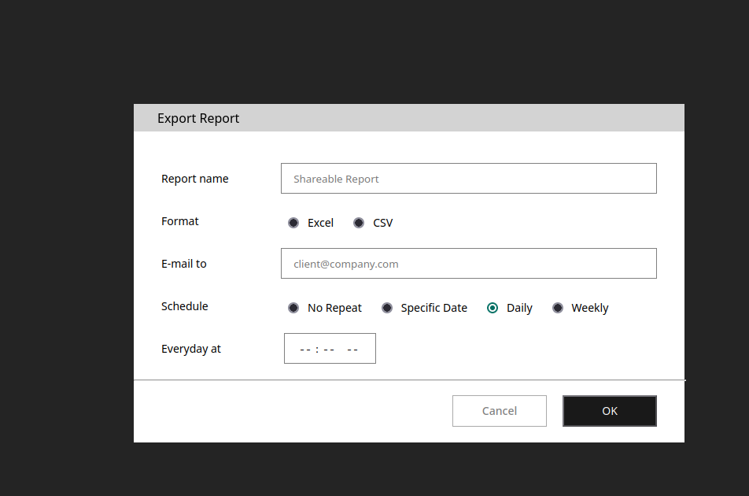

### Demo of the modal component

---



This project uses vite under the hood.
To run it you need yarn 2 installed on your PC.

#### Installing dependacies
```bash
yarn install
```

#### Starting project
```bash
yarn dev
```